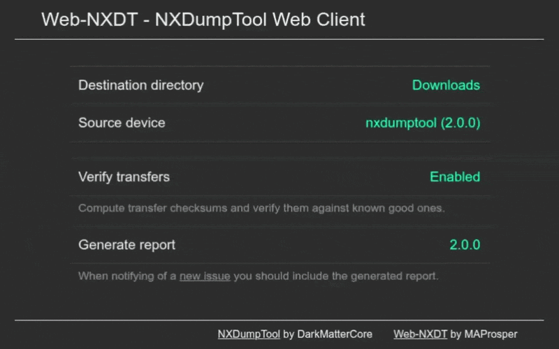

# Web-NXDT - NXDumpTool Web Client
Web version of NXDT USB host tool

Try it out: <https://nxdt.m16r.xyz>

## Compatibility
Tested on Windows, macOS, Linux on Chromium-based browsers.

Requires support for [WebUSB](https://developer.mozilla.org/docs/Web/API/WebUSB_API) and [window.showDirectoryPicker](https://developer.mozilla.org/docs/Web/API/Window/showDirectoryPicker).

## Repositories
- [NXDumpTool](https://github.com/DarkMatterCore/nxdumptool) by DarkMatterCore
- [Web-NXDT](https://github.com/MAProsper/web-nxdt) by MAProsper
